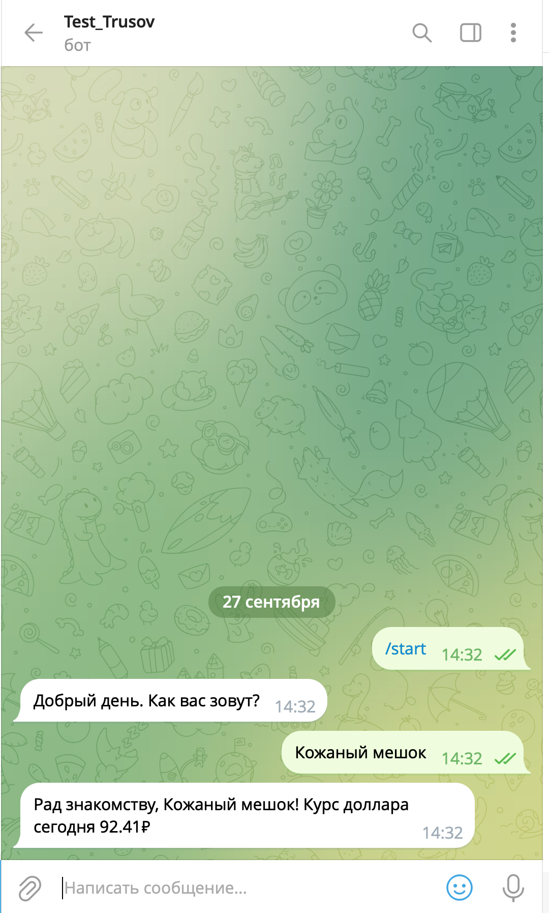

# Инструкция по установке и запуску бота

### Предварительные требования

- Python 3.7 или выше установлен на вашем компьютере.
- Установлен пакетный менеджер pip.
- Учетная запись в Telegram для взаимодействия с ботом.
- Токен бота, полученный от @BotFather.

### Шаг 1: Создание виртуального окружения

Рекомендуется использовать виртуальное окружение для изоляции зависимостей проекта.
```bash
# Создайте виртуальное окружение
python -m venv venv

# Активируйте виртуальное окружение
# Для Windows:
venv\Scripts\activate

# Для macOS и Linux:
source venv/bin/activate
```

### Шаг 2: Установка зависимостей

Установите необходимые библиотеки, перечисленные в requirements.txt.

```bash
pip install -r requirements.txt
```
### Шаг 3: Настройка токена бота

1. Получите токен бота, если вы еще этого не сделали:
   - Откройте Telegram и найдите бота @BotFather.
   - Отправьте команду /newbot и следуйте инструкциям для создания нового бота.
   - Сохраните выданный токен API.
2. Создайте файл config.py в корневой папке проекта и добавьте в него ваш токен:
```python
TOKEN = 'ВАШ_ТОКЕН_БОТА'
#Важно: Замените 'ВАШ_ТОКЕН_БОТА' на токен, полученный от @BotFather.
```
### Шаг 4: Запуск бота

Запустите скрипт bot.py для запуска бота.

```python
python bot.py
# Убедитесь, что вы находитесь в корневой директории проекта и виртуальное окружение активировано (если вы его используете).
```
### Шаг 5: Проверка работы бота

1. Найдите бота в Telegram по его имени пользователя (username), которое вы указали при создании бота.
2. Начните диалог с ботом:
3. Нажмите кнопку Start или отправьте команду /start.
4. Введите свое имя по запросу бота.
5. Бот поприветствует вас и сообщит текущий курс доллара.

## Пример взаимодействия с ботом
